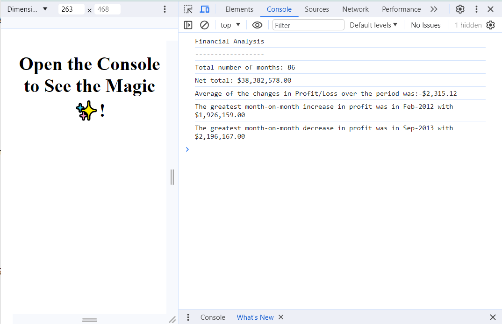

# Console-finances

Financial data analysis completed using JavaScript.

## Description

This project is a Javascript code written to analyse the financial records of a company. It uses a dataset in the form of a multidimensional array containing a company's monthly revenue, which can be found in the JavaScript file.

The code calculates the number of months the data was collected over, the net profit over this time period, the average change in profit/loss over the period, and the month that saw the greatest increase in profit month-on-month, as well as the greatest decrease in profit (i.e. loss).

The project was a good opportunity to practice applying the JavaScript skills learnt in Week 4 of the Front-End Web Development bootcamp and begin thinking in a logical way to solve problems using code. This was my first encounter with multidimensional arrays, which required additional logical thinking and problem solving.

Solving the challenge required use of 'for' loops and mathematics to compare values within the array, and update variables accordingly. A new array was then created to concatenate the results and display them clearly. The .toLocaleString function also came in handy to correctly format the results and make them as legible as possible.

## Installation

* Copy the following link: https://github.com/rosiegalezia/Console-finances.git

* Open Git Bash

* Change the current working directory to the desired location for the cloned directory using the cd command

* Use the command git clone followed by the url https://github.com/rosiegalezia/Console-finances.git and press enter to clone locally

## Usage

The deployed site is available at: https://rosiegalezia.github.io/Console-finances/

A screenshot of the site and its console log can  be seen below:

## Credits

N/A

## License

MIT License

Copyright (c) 2023 rosiegalezia

Permission is hereby granted, free of charge, to any person obtaining a copy of this software and associated documentation files (the "Software"), to deal in the Software without restriction, including without limitation the rights to use, copy, modify, merge, publish, distribute, sublicense, and/or sell copies of the Software, and to permit persons to whom the Software is furnished to do so, subject to the following conditions:

The above copyright notice and this permission notice shall be included in all copies or substantial portions of the Software.

THE SOFTWARE IS PROVIDED "AS IS", WITHOUT WARRANTY OF ANY KIND, EXPRESS OR IMPLIED, INCLUDING BUT NOT LIMITED TO THE WARRANTIES OF MERCHANTABILITY, FITNESS FOR A PARTICULAR PURPOSE AND NONINFRINGEMENT. IN NO EVENT SHALL THE AUTHORS OR COPYRIGHT HOLDERS BE LIABLE FOR ANY CLAIM, DAMAGES OR OTHER LIABILITY, WHETHER IN AN ACTION OF CONTRACT, TORT OR OTHERWISE, ARISING FROM, OUT OF OR IN CONNECTION WITH THE SOFTWARE OR THE USE OR OTHER DEALINGS IN THE SOFTWARE.